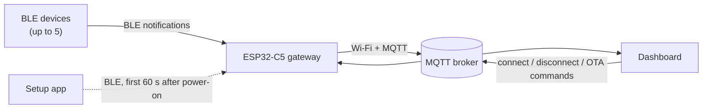

# ESP32-C5 BLE Gateway

Firmware for an ESP32-C5 gateway that collects data from BLE medical
wearables and forwards it to an MQTT broker over Wi-Fi. A dashboard controls
which devices the gateway connects to, and can update the gateway's firmware
over the air.

Built with **ESP-IDF v6.1** and the NimBLE host.

## Features

- **Multiple devices at once:** up to 5 BLE devices connected at the same time.
- **Several device types:** each product has its own driver, and devices are
  recognised by their advertised name.
- **Controlled by the dashboard:** the gateway connects or disconnects a device
  when told to over MQTT. An optional auto-connect mode is available for bench
  testing.
- **No data lost during outages:** every BLE packet is buffered in PSRAM (about
  8000 packets) and sent once Wi-Fi or the broker comes back.
- **Self-healing links:** Wi-Fi, MQTT and BLE reconnect on their own. A device
  that goes silent is dropped so its slot can be reused.
- **Setup over BLE:** after a power cycle the gateway opens a short BLE window
  where a mobile app can set the Wi-Fi and broker details, with no rebuild
  needed.
- **Firmware updates over the air:** triggered by an MQTT command, with
  progress reported back over MQTT.
- **Monitoring:** a heartbeat every 10 s, a scan list every 5 s, and a status
  block on the serial console every 5 s.
- **Crash dumps:** a crash is saved to flash so it can be analysed afterwards.

## Supported devices

| Device | Advertised name starts with | Reported type |
| --- | --- | --- |
| Lepu ER1 ECG belt | `ER1` | `LEPU_BELT` |
| FrontierX ECG belt | `FrontierX` | `ECG_Belt` |
| ezLife ECG belt | `ezLife -` | `ezLife` |
| LS06 | `LS06` | `LS06` |
| Berry watch | `Berry` | `BERRY_WATCH` |
| Checkme O2 pulse oximeter | `O2M` | `CHECKME` |
| LS_MERC temperature patch | `LS_MERC_` | `LS_MERC_` |
| Genial T31 watch | `Genial-T31` | `Genial-T31` |

To add a device, write a new driver file (`main/dev_*.c`) and add one entry
to [main/device_table.c](main/device_table.c). The rest of the gateway needs
no changes.

## How it works



### Startup

1. **Power on.** If the board was power-cycled (or the reset button was
   pressed), the gateway runs **setup mode** for 60 s: it advertises as a BLE
   peripheral so the setup app can send Wi-Fi and broker details. It then
   restarts. After a software restart (for example after a crash or an OTA
   update) it skips this step and goes straight to work.
2. **Network.** It joins Wi-Fi (2.4 or 5 GHz) and connects to the MQTT broker.
3. **BLE.** It starts scanning and publishes a list of the supported devices
   it can hear.
4. **Connect.** When the dashboard sends a `connect` command, the gateway
   connects to that device the next time it sees it advertising. It then reads
   the device's details and starts receiving its data.
5. **Stream.** Every BLE packet is buffered and published to MQTT as hex, with
   the device's details attached.

The gateway stops scanning while all slots are full and starts again as soon
as a slot frees up.

## Connections

### BLE

- Acts as a **central** in normal operation: scans for devices, connects to
  them and subscribes to their data.
- Acts as a **peripheral** only during the setup window.
- Wi-Fi and BLE share one radio, and BLE gets priority by default.

### Wi-Fi

- Station mode, 2.4 GHz and/or 5 GHz.
- Credentials come from the setup app (stored in flash). If none have been
  set, the defaults from `menuconfig` are used.

### MQTT

Plain TCP (no TLS). `<ROUTER_MAC>` is the gateway's Wi-Fi MAC address.

| Direction | Topic | Purpose |
| --- | --- | --- |
| In | `ble/router/command/<ROUTER_MAC>` | Commands for this gateway |
| In | `gateways/command/broadcast` | Commands for the whole fleet (must include `target_mac` set to this gateway's MAC, or `"all"`) |
| Out | `ble/device/data` | Device data packets |
| Out | `ble/device/status` | Device connected/disconnected events, plus the gateway heartbeat |
| Out | `ble/router/scan` | Supported devices currently in range |
| Out | `gateways/ota_status` | Firmware update progress and result |
| Out | `ble/<client id>/status` | `online` / `offline` (retained, with last will) |

Commands:

```json
{"command":"connect","deviceMac":"f6:43:aa:80:68:cb"}
{"command":"connect","DeviceID":"ER1-L 0173"}
{"command":"disconnect","deviceMac":"f6:43:aa:80:68:cb"}
{"command":"ota_update","target_mac":"all","url":"http://host/firmware.bin","version":"1.1.0"}
```

Data packet:

```json
{"deviceType":"LEPU_BELT","deviceName":"ER10173","deviceMac":"f6:43:aa:80:68:cb",
 "routerMac":"38:44:BE:AA:24:6C","HardwareVersion":"0.1.0","softwareVersion":"0.1.0",
 "seq":7,"value":"A503FC01001600FFFF005C65..."}
```

### Setup mode (BLE)

| UUID | Access | Purpose |
| --- | --- | --- |
| `0x1234` | Service | Setup service |
| `0x1235` | Read / notify | Current settings |
| `0x1236` | Write | Commands |

Commands written to `0x1236`:

- `#WIFI,<ssid>,<password>,$`
- `#MQTT,<broker>,$`
- `#ALL,<ssid>,<password>,<broker>,$`

Values can't contain commas, because the gateway splits commands on every
comma.

## Hardware

- **Module:** ESP32-C5-WROOM-1U-N8R8 (8 MB flash, 8 MB PSRAM)
- **Flash layout:** two 3 MB firmware slots for OTA, plus areas for settings
  (NVS), crash dumps and spare storage. See
  [partitions.csv](partitions.csv).

## Build and flash

```bash
idf.py set-target esp32c5
idf.py menuconfig      # BLE Gateway Configuration: Wi-Fi, MQTT, BLE limits
idf.py -p /dev/ttyACM0 flash monitor
```

- After changing the partition table, run `idf.py erase-flash` once before
  flashing.
- To read a saved crash dump: `idf.py coredump-info`.

## Configuration

All options are under **BLE Gateway Configuration** in `menuconfig`, defined in
[main/Kconfig.projbuild](main/Kconfig.projbuild). The main ones:

| Option | Default | Meaning |
| --- | --- | --- |
| `GW_NAME_PREFIX` | `GATEWAY_` | Gateway name, followed by the last 3 bytes of the MAC |
| `BLE_MAX_DEVICES` | `5` | Devices connected at once |
| `BLE_AUTO_CONNECT` | off | Connect to any supported device in range without waiting for a command |
| `BLE_MIN_RSSI` | `-85` dBm | Weaker devices are listed in the scan but not connected |
| `BLE_DATA_TIMEOUT_MS` | `20000` | Disconnect a device that sends nothing for this long |
| `GW_CONFIG_MODE_ENABLE` | on | BLE setup window after power-on |
| `GW_MQTT_BROKER_URI` | set in menuconfig | Broker used until one is set through the setup app |
| `GW_UPLINK_QUEUE_LEN` | `8192` | Packets buffered while the broker is unreachable |

Keep `BLE_GAP_KNOWN_GOOD` turned on: the belts stop streaming data without it.
